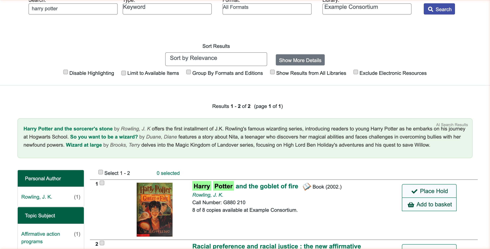
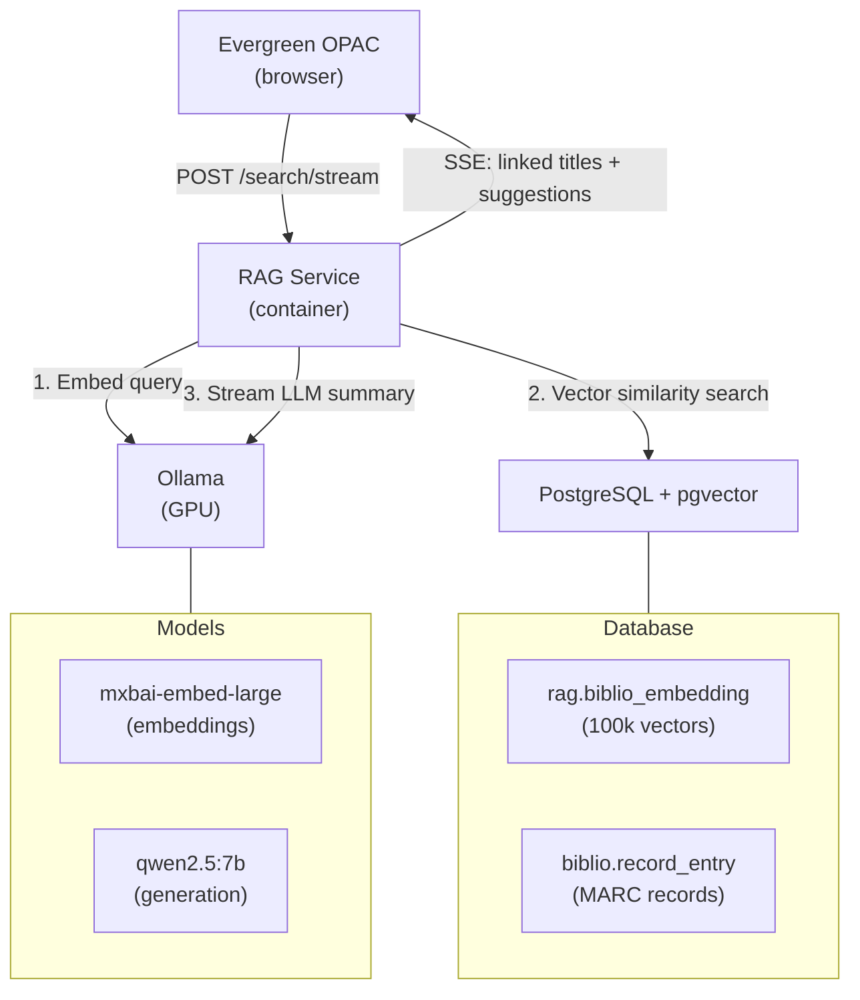

# Evergreen RAG

Retrieval-Augmented Generation (RAG) for [Evergreen ILS](https://evergreen-ils.org/) catalog search.

## What is RAG?

Traditional library catalog search works by matching **exact keywords** — if a patron types "books about a boy who goes to wizard school," the catalog finds nothing because those exact words don't appear in any MARC record. The patron has to already know the title or subject heading to find what they're looking for.

**Retrieval-Augmented Generation** changes this. RAG works in two steps:

1. **Semantic search** — Instead of matching keywords, RAG understands the *meaning* of a query. It converts both the catalog records and the search query into mathematical representations (embeddings) that capture semantic similarity. "Boy who goes to wizard school" becomes close to "Harry Potter" in this space, even though they share no words in common.

2. **AI-generated guidance** — After finding relevant records, a local language model writes a brief, helpful summary explaining *why* each title might be what the patron is looking for, with direct links to the catalog records.

The result: patrons can search the way they naturally think and speak, and the catalog responds with relevant materials — even for misspellings, synonyms, mood-based queries ("something funny to read on vacation"), and conceptual searches ("video game movie").

## Privacy First

**Every part of this system runs on your own servers.** No patron queries, search history, or catalog data are ever sent to a cloud service. The AI models run locally via [Ollama](https://ollama.com/) on hardware you control.

This matters because libraries have a [long tradition](https://www.ala.org/advocacy/privacy) of protecting patron privacy. Unlike cloud-based AI search products, Evergreen RAG ensures that what patrons search for stays between them and their library — no third-party data processing, no API calls to external services, no telemetry.

## RAG vs. Keyword Search — Test Results

Tested against a catalog of 100,000 MARC records (SFPL dataset):

| # | Query | Keyword | RAG | Winner |
|---|-------|---------|-----|--------|
| 1 | harry potter | 2 results (exact match) | 3 results (HP + related wizard books) | Tie — both found relevant results, RAG added breadth |
| 2 | books about a boy who goes to wizard school | 0 results | Harry Potter, So You Want to Be a Wizard? | **RAG** — understood natural language intent |
| 3 | something funny to read on vacation | 0 results | Humor/travel books (Separated at Birth, If God Wanted Us to Travel) | **RAG** — handled mood/intent-based query |
| 4 | automobile repair manual | 0 results | Automotive Technician's Handbook + related auto books | **RAG** — matched synonyms (automobile ↔ automotive) |
| 5 | what should I read if I liked lord of the rings | 0 results | Fellowship of the Ring, A Tolkien Compass | **RAG** — understood recommendation-style question |
| 6 | cooking Italian | 0 results | Italian Family Cooking, Regional Italian Kitchen, Food of Southern Italy | **RAG** — connected topic concepts |
| 7 | video game movie | 0 results | Free Guy, Ready Player Two | **RAG** — bridged concept (video game + movie/novel) |
| 8 | dinasaur books for kids (misspelled) | 0 results | Danny and the Dinosaur, The Dinosaur Princess | **RAG** — handled misspelling gracefully |

Keyword search returned **0 results on 7 out of 8 non-trivial queries**. RAG found relevant material every time.

## How It Works

The RAG service is a **sidecar** — it requires no modifications to Evergreen's codebase. It reads MARC records from the existing database, maintains its own vector index, and integrates with the OPAC via a JavaScript snippet injected into the results template.

## Requirements

- [Docker](https://docs.docker.com/get-docker/) or [Podman](https://podman.io/)
- PostgreSQL 14+ with [pgvector](https://github.com/pgvector/pgvector)
- [Ollama](https://ollama.com/) with a GPU (or CPU, but slower)
- Evergreen ILS (for OPAC integration; RAG service works standalone)

See the [Installation Guide](docs/installation.md) for step-by-step setup, hardware sizing, and model recommendations.

## API Endpoints

| Endpoint | Method | Description |
|----------|--------|-------------|
| `/search` | POST | Semantic search with optional AI summary |
| `/search/stream` | POST | Streaming search via Server-Sent Events |
| `/search/merged` | POST | Hybrid keyword + semantic search (RRF fusion) |
| `/recommend` | POST | Reading recommendations from results |
| `/refine` | POST | Suggest related search queries |
| `/health` | GET | Service health check |
| `/stats` | GET | Embedding statistics |
| `/ingest` | POST | Trigger re-embedding (private network only) |

## OPAC Integration

The RAG service integrates with Evergreen's OPAC by injecting a streaming search widget into the results page. When a patron searches, the widget:

1. Sends the query to `/search/stream`
2. Displays AI-generated text token-by-token as it arrives
3. Expands record references into clickable links to the catalog
4. Shows related search suggestions

No Evergreen code changes required — just an Apache reverse proxy and a template include. See the [Installation Guide](docs/installation.md#7-integrate-with-evergreen-opac-optional) for details.

## License

GPL-2.0 — matching [Evergreen ILS](https://evergreen-ils.org/).
